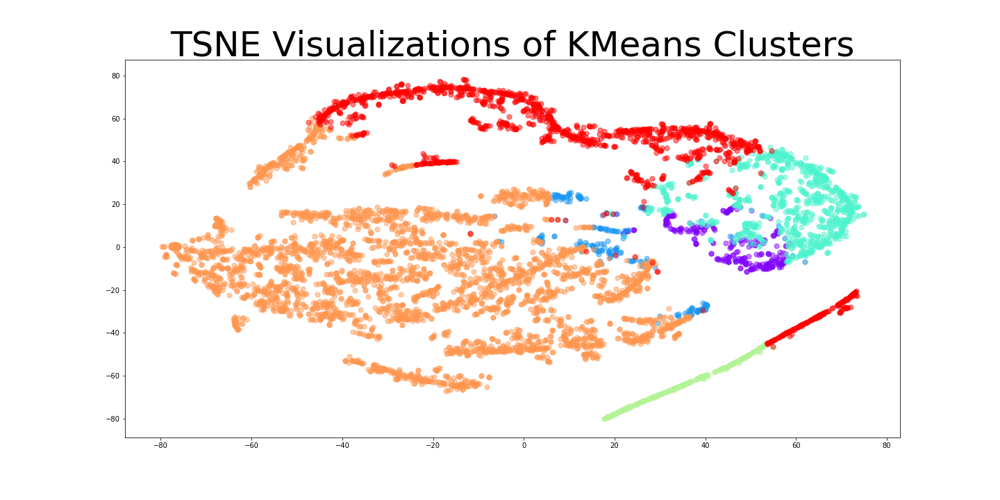

# Metis Project 5

## Project Summary

### Intro
In 2013, the Tampa Bay Times, Center for Investigative Reporting, and CNN put together a report on the [50 Worst Charities in America](https://www.tampabay.com/topics/specials/worst-charities/). This incredible report was the product of a year-long investigation into 10 years of IRS returns for 5,600 organization, pored over by hand. Unsurprisingly, there has not been a similar effort undertaken since.

So I set out to see if I could produce something similar with the data science skills I have learned over the past 12 weeks. I wanted to find outliers like the ones identified in the report so I used a technique called anomaly detection, which consistent of finding data, clustering to separate similar organizations into groups, and outlier detection to find organizations whose operations were out of the ordinary in some way. While outliers found through this approach would by no means be guaranteed to be the same types of morally questionable organizations listed in the report, they could at least provide a more narrow search space assuming these types of shady operations are unusual enough to be identified.

### Data
The IRS has been releasing required non-profit 990 forms in machine-readable format since June of 2016, which is hosted publicly on Amazon Web Services s3 storage platform with records going back as far as 2011. To get these data from their native XML format to a database of key-value pairs I followed [Charity Nativagor's protocol on GitHub](https://github.com/CharityNavigator/990_long). From there I used Amazon Athena and the Nonprofit Open Data Collective's [Master Concordance File](https://github.com/Nonprofit-Open-Data-Collective/irs-efile-master-concordance-file) to parse through and pull financial data on as many organization as I could. I ended up with 25 features for each organization -- primarily financial information disclosed on the forms totals and breakdowns by category for revenue, expenses, and assets.

### Clustering
Once I had my data, I applied a variety of clustering algorithms to uncover hidden structure in the data, including KMeans, Agglomerative Clustering, Spectral Clustering, and HDBScan. Evaluating the clustering with a combination of inertia, silhouette score, and inter-algorithm similarity, I landed on KMeans clustering with a K of 6. To get a sense of what's going on, here's a TSNE visualization of the clusters:

### Outlier Detection
Once I had clusters, I was able to try a range of outlier detection algorithms including Local Outlier Frequency, an Isolation Forest, and a One-Class SVM which I used in conjunction with the built-in non-clustering from HDBScan to come up with a final list of anomalous organizations. As an example, the most anomalous charity found was Here at Home Song Foundation, Inc, which was unique as it had only $50 in total revenue, $0 in total expenses, yet $4,328 in total assets and $11,987 in total liabilities. While an initial search didn't turn up any online presense for this organization and I will not draw any conclusions from this alone, it is may be an organization worth investigating further. 

### Conclusions + Next Steps
Moving forward with this project, I would like to include more features in the process, including the National Taxonomy Organization for Exempt Organization tag for each organization, which provides labels for the sector in which an organization provides services, such as education or arts. I imagine organizations vary significantly depending on their area, so that information would undoubtedly be helpful. Additionally I hope to further investigate the identified outliers, and do a blog exploring the reasons they have been identified as outliers as a potential resource for further research.  
